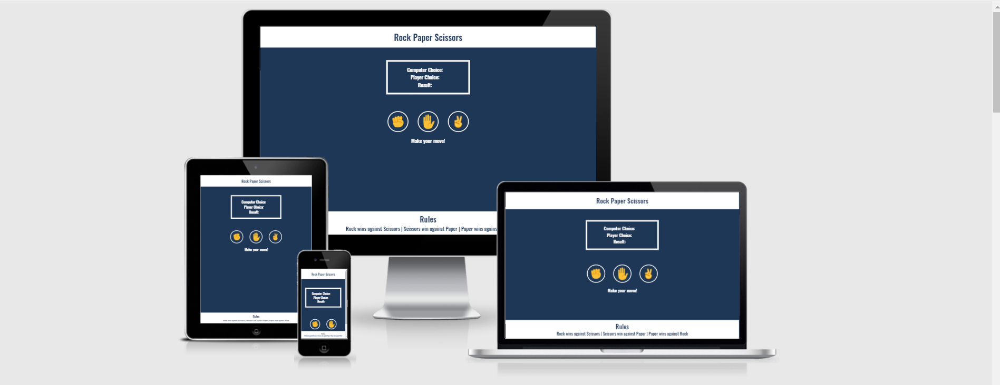
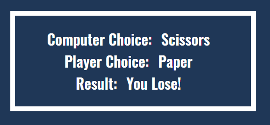
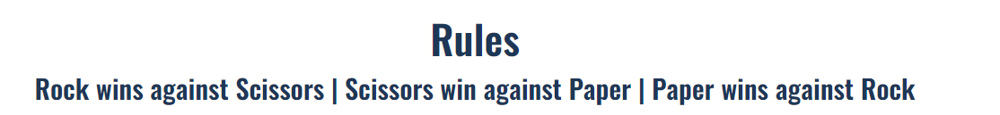
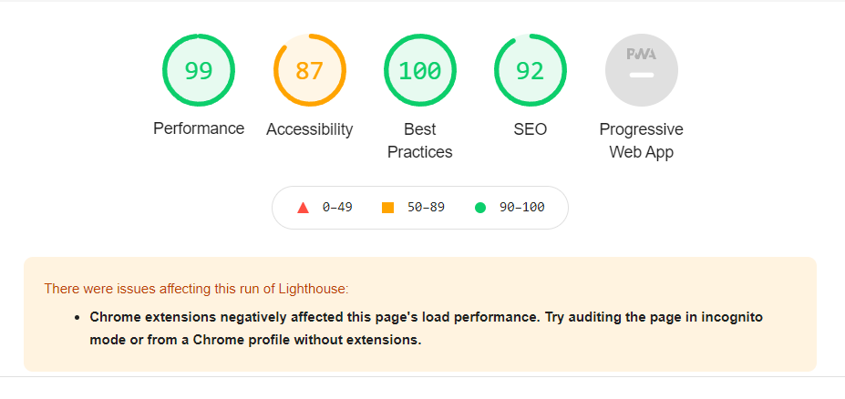

# Rock Papaer scissors

Rock paper scissors are played between two people, in which each player simultaneously forms one of three shapes with an outstretched hand. These shapes are "rock" (a closed fist), "paper" (a flat hand), and "scissors" (a fist with the index finger and middle finger extended, forming a V.

In this game, the user’s opponent is the computer and the computer chose randomly rock paper and scissors. Users of the game will learn the rules of the game. 

## Features

### Existing Features

- __Header__

  - Featured at the top of the page, the title shows the name of the game: Rock Paper Scissors 

- __Game Option__

  - The user has three-game choices which are rock paper or scissors. These choices are interactive image buttons that users can click to make their choice and play the game.  
  - 

- __Scoreboard__

  - 

- __The Footer__

  - The footer section displays the rules for the game Rock Paper Scissors.

## Testing 

- I tested to play this game in two browsers: Chrome and Firefox.
- I tested if the website was responsive in Chrome and Firefox.
- I tested this game by running it through Lighthouse in devtools.

### Validator Testing 

- HTML
  - No errors were returned when passing through the official [W3C validator](https://validator.w3.org/nu/#textarea)
- CSS
  - No errors were found when passing through the official [(Jigsaw) validator](https://jigsaw.w3.org/css-validator/validator)
- JS 
  - No errors were found when passing through the official [(Jshint) validator](https://jshint.com/)
  -  

## Deployment

This section should describe the process you went through to deploy the project to a hosting platform (e.g. GitHub) 

- The site was deployed to GitHub pages. The steps to deploy are as follows: 
  - In the GitHub repository, navigate to the Settings tab 
  - From the source section drop-down menu, select the Master Branch
  - Once the master branch has been selected, the page will be automatically refreshed with a detailed ribbon display to indicate the successful deployment. 

The live link can be found here -  https://yonastekle.github.io/rock-paper-scissors-game/ 

## Credits 

### Content 

- The text for the Home REDME page was taken from Wikipedia Article A https://en.wikipedia.org/wiki/Rock_paper_scissors
- Instructions on how to implement form validation on the Sign Up page was taken from [Specific YouTube Tutorial](https://www.youtube.com/)
- The fonts were taken from [Google Fonts](https://fonts.google.com/)
- The emoji images in the gamearea were taken from [Cleanpng](https://www.cleanpng.com/png-cut-resistant-gloves-emoji-test-apk-hand-hand-emoj-883837/download-png.html)

